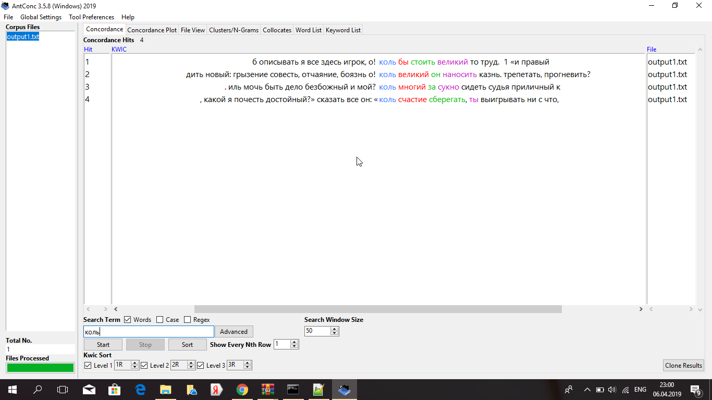
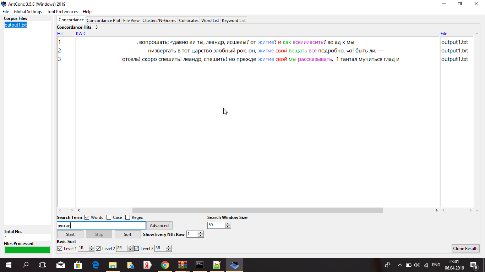
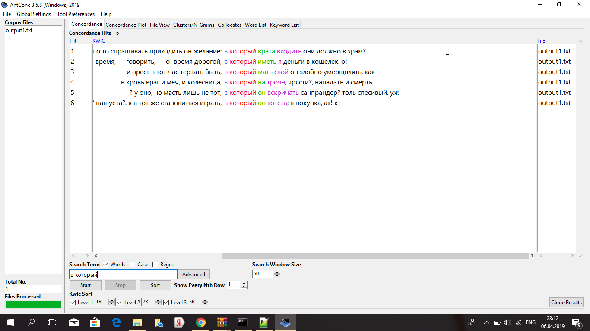
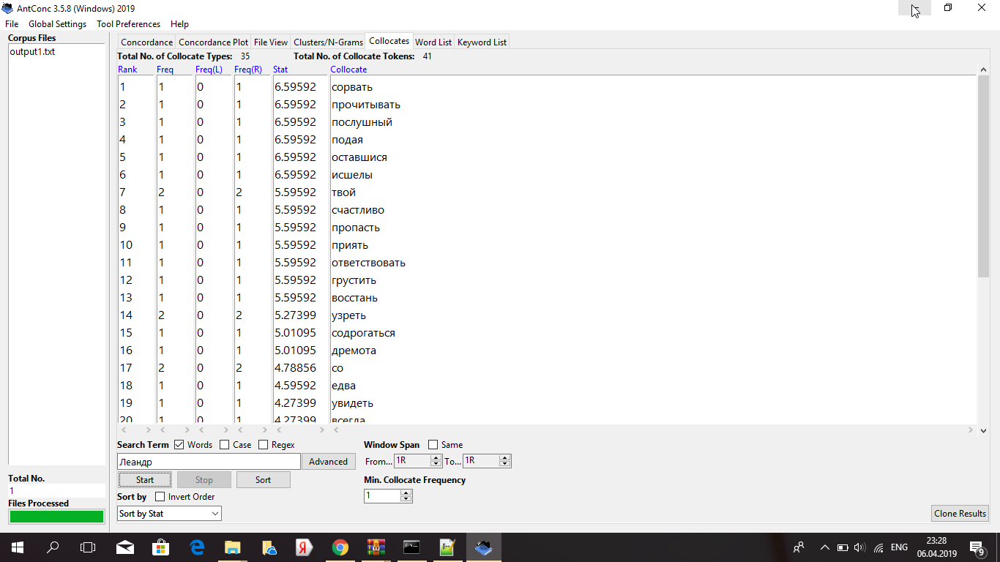
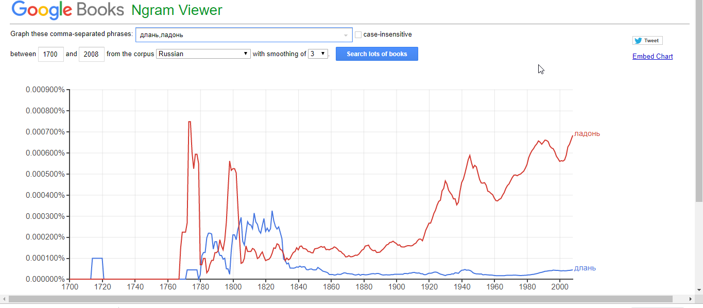
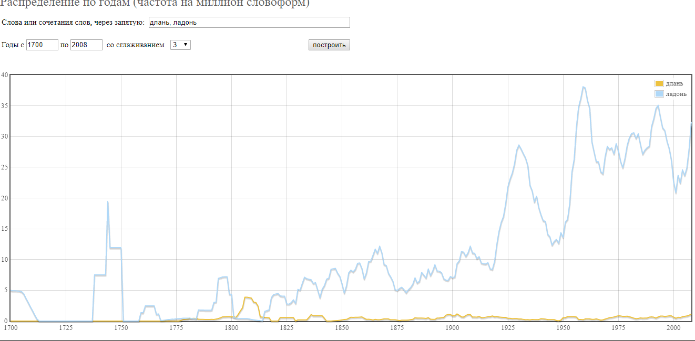
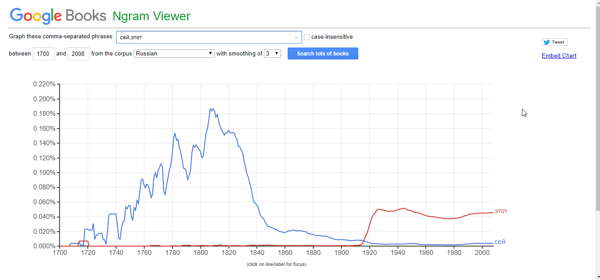
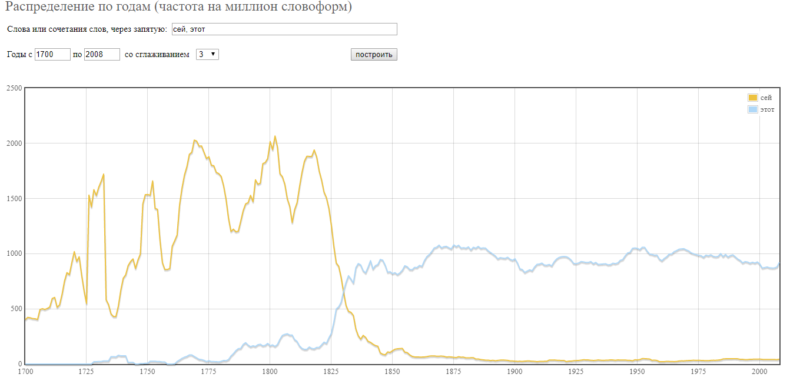
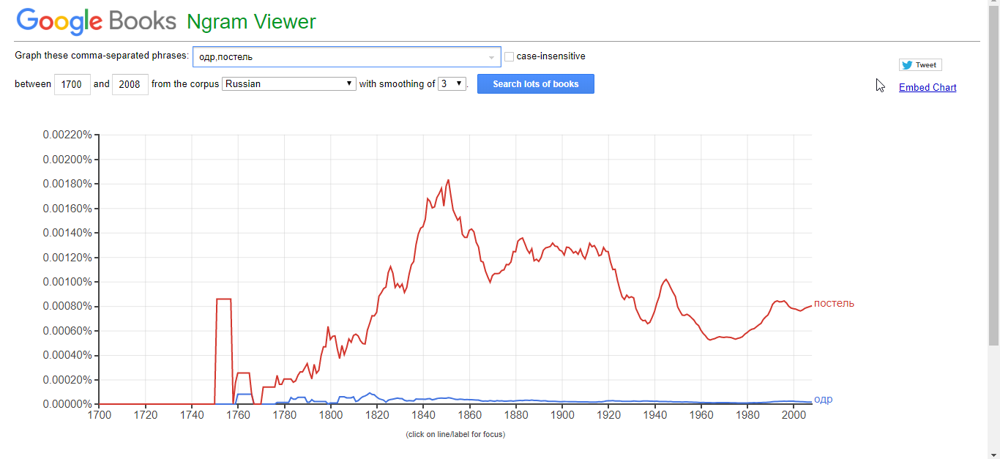
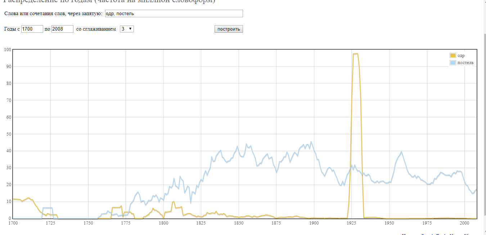

# HW3

4)

5)

6)

Работа с корпусами НКРЯ и Google Ngrams:

"Ладонь" всегда (в рассматриваемом промежутке) употреблялось больше, чем "длань". Причем некий всплеск употребления устаревшего слова "длань" мы можем наблюдать в начале XIX, что, возможно, связано с расцветом романтизма.

ipm слова "длань"=0.51158661475

ipm слова "ладонь"=18.9639865815

Здесь графики отличаются друг от друга. Как мы видим на графике Google Ngrams, привычное нам слово "этот", в отличие от слова "сей" практически не употреблялось, в обиход оно вошло в начале XX века, в то время как на графике НКРЯ показано, что "этот" стало заменять слово "сей" уже в начале XIX века.

ipm слова "сей"= 90.9812692052

ipm слова "этот"=905.868182843

На графике Google Ngrams "постель" (в рассматриваемом промежутке) всегда употреблялось значительно чаще, нежели слово "одр". На графике НКРЯ мы можем наблюдать всплеск употребления слова "сей" в 1930х годах.

ipm слова "одр"=6.13903937709

ipm слова "постель"=25.5369925353

Было интересно сравнить, в какие периоды и какие слова пользовались наибольшей популярностью и были более употребимы в художественных текстах. Думаю, что умение работать с корпусами очень важно для филолога в наше время, и, уверена, оно мне обязательно пригодится.
